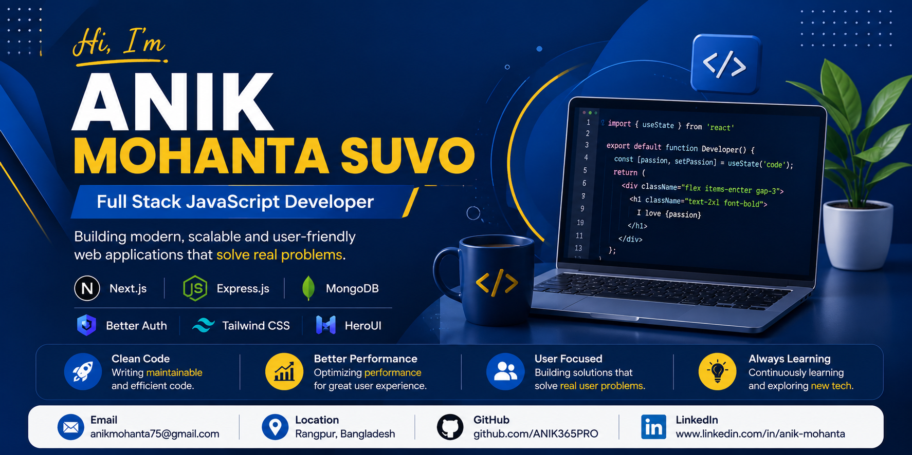

  

# Hi 👋, I'm Anik Mohanta Suvo

## 💻 Full-Stack Web Developer

Turning ideas into modern, scalable, and user-focused web experiences. Based in Bangladesh, I specialize in React, Next.js, and the MERN stack, building secure, responsive platforms from frontend interfaces to backend APIs. I am passionate about writing clean code, implementing robust authentication, and creating highly interactive UIs with modern animations.

---

## 🚀 Current Activities

- 🌱 Improving my Next.js App Router skills
- 🔥 Building SkillSwap — a freelance & skill-sharing platform
- 💡 Exploring Better Auth and secure authentication
- 🎨 Learning GSAP, Framer Motion, and modern UI animation
- 📚 Improving my Express.js & MongoDB skills
---

## 🛠️ Skills

  

**Also familiar with:** 
HeroUI • DaisyUI • Better Auth • GSAP • Framer Motion • Lenis • REST APIs • Next.js Server Actions

---

## 🚀 Featured Projects

### 🚗 DriveFleet — Vehicle Management Web Application

A full-stack vehicle rental platform focused on seamless vehicle booking and management.

**Key Features:**
- 🔐 Secure authentication and session management with Better Auth
- 🎨 Responsive UI built with Next.js App Router and Tailwind CSS
- 🔍 Advanced vehicle search and filtering
- 🛠️ Complete CRUD operations
- 📱 Fully responsive design

**Tech Stack:** Next.js • React • MongoDB • Tailwind CSS • Better Auth

[🌐 Live Demo](https://drivefleet-a9-m55.vercel.app) • [💻 Client](https://github.com/ANIK365PRO/DriveFleet-a9-m55) • [⚙️ Server](https://github.com/ANIK365PRO/DriveFleet-server-a9-m55)

---

### 🤝 SkillSwap — Skill Sharing & Freelance Platform

A full-stack platform for discovering skills, posting tasks, and managing freelance proposals.

**Key Features:**
- ⚡ Next.js Server Actions
- 🗄️ MongoDB queries for proposal management
- 📊 Active project status management
- 🚨 Custom error boundaries
- 🔐 Secure client-server architecture
- 📱 Responsive interface

**Tech Stack:** Next.js • React • MongoDB • Tailwind CSS • Better Auth • Server Actions

[🌐 Live Demo](https://skillswap-client-a10-m63.vercel.app) • [💻 Client](https://github.com/ANIK365PRO/skillswap-client-a10-m63) • [⚙️ Server](https://github.com/ANIK365PRO/skillswap-server-a10-m63)

---

## 🌐 Connect with Me

  
  

- 📍 Rangpur, Bangladesh

---

## 📊 GitHub Stats

  

---

## 💻 Most Used Languages

  

---

## 🔥 GitHub Streak

  

